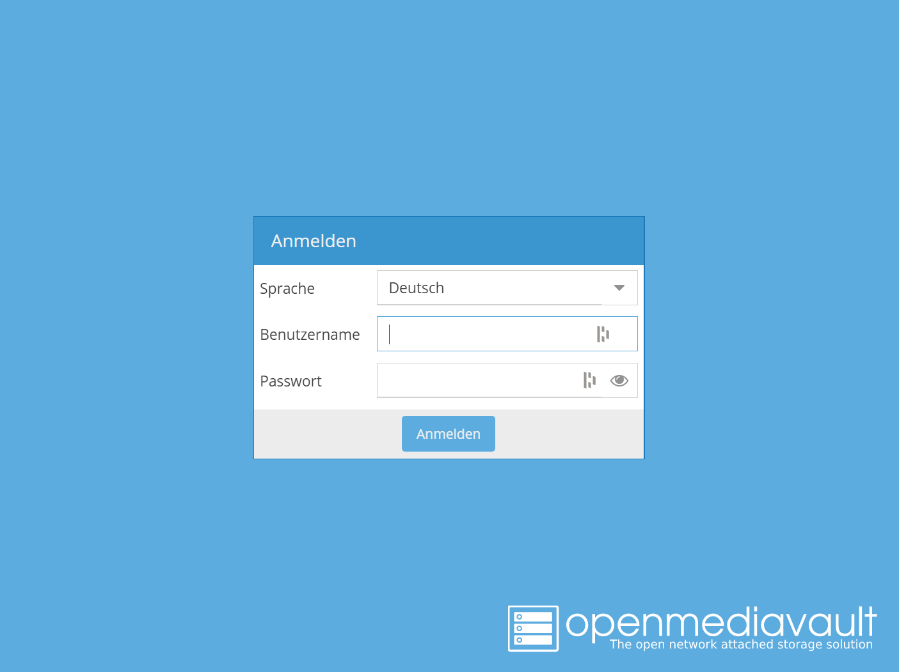
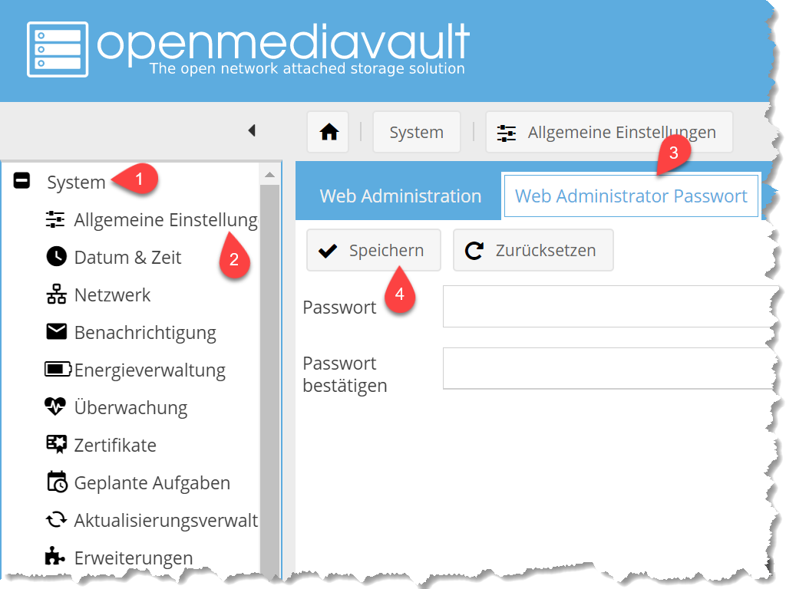
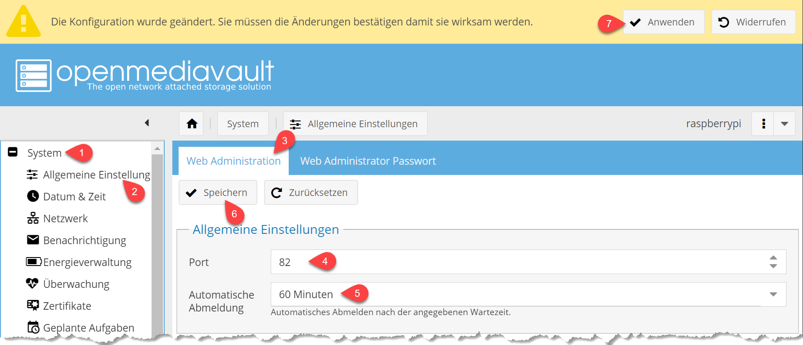

# OpenMediaFault

openmediavault ist eine NAS-Lösung (Network Attached Storage) der nächsten Generation, die auf Debian Linux basiert. Es enthält Dienste wie SSH, (S) FTP, SMB / CIFS, DAAP-Medienserver, RSync, BitTorrent-Client und viele mehr. Dank des modularen Aufbaus des Frameworks kann es über Plugins erweitert werden.

openmediavault wurde hauptsächlich für den Einsatz in kleinen Büros oder Heimbüros entwickelt, ist jedoch nicht auf diese Szenarien beschränkt. Es ist eine einfache und benutzerfreundliche Out-of-the-Box-Lösung, mit der jeder einen Network Attached Storage ohne tiefere Kenntnisse installieren und verwalten kann.

## Inhaltsverzeichnis
[[toc]]

## Installation

- Starte Putty und gib die IP Adresse deines PIs ein und verbinde dich mit SSH zu deinem Raspberry.

- Logge dich mit dem Benutzernamen 'pi' und dem Passwort, dass du vorhin vergeben hast  auf dem Pi ein.

- Zuerst aktualisiere wie immer die Paketquellen und Pakete. Gib dazu folgenden Befehl in Putty ein
```bash
sudo apt-get update && sudo apt-get upgrade
```

- Danach starte die Installation von OpenMediaVault indem du in Putty folgenden Befehl eingibst
```bash
wget -O - https://github.com/OpenMediaVault-Plugin-Developers/installScript/raw/master/install | sudo bash
```

- Die Installation kann einige Zeit in Anspruch nehmen. Wenn die Installation abgeschlossen ist, wird dir wieder die Eingabeshell angezeigt.

```bash
pi@raspberry:~$
```

- Starte den Pi neu, indem du folgendes in Putty eingibst

```bash
sudo reboot
```

- Fertig.

## Ersteinrichtung

### Der erste Login

- Nach 3 bis 5 Minuten nachdem der Pi fertig gestartet ist, kannst du dich über den Webbrowser am OpenMediaVault anmelden. Gib dazu einfach die IP Adresse deines PIs im Webbrowser ein.

:::tip Standard Login
**Username:** admin  
**Passwort:** openmediavault
:::



### Die Logindaten ändern

Als erstessollten wir das Passwort ändern, denn alle OpenMediaVault Installationen besitzen bei der Installation das gleiche Passwort. Dies stellt natürlich eine Sicherheitslücke da.

- Navigiere dazu im linken Navigationsmenü nach '(1) System -> (2) Allgemeine Einstellungen' und aktiviere den Tab '(3) Web Administrator Passwort'. 

- Gib ein neues Passwort ein und speichere es mit einem Klick auf '(4) Speichern'.



### Port und Auto Logout ändern

Als nächstes ändern wir den Port und das automatische Ausloggen von OpenMediaVault.

- Navigiere dazu im linken Navigationsmenü nach '(1) System -> (2) Allgemeine Einstellungen' und aktiviere den Tab '(3) Web Administrator '.

- Hier ändern wir den Standartport (4) '80' auf '82' ab und stellen die (5) 'Automatische  Abmeldung' auf 60 Minuten ein.

- Klicke auf (6) Speichern, um die Änderung zu speichern.

- In der sich daraufhin öffnenden Notificationbar klicke auf (7) 'Anwenden' um die Änderung zu übernehmen. Der Speichervorgang kann einige Zeit in Anspruch nehmen.

- Danach ist das OpenMediaVault nicht mehr über den Standartport erreichbar und es wird eine Fehlermeldung angezeigt. Korrigiere die IP Adresse in deinem Browser indem du ein ':82' an die IP anfügst. 

- Nun kannst du dich wieder in deinem OpenMediaVault anmelden.



### Datenträger anschließen

Folgende Hard.- und Software verwende ich für das Projekt Homeserver

```yaml
version: '3'

services:
  web:
    image: nginx:alpine
    volumes:
    - ./.vuepress/dist:/usr/share/nginx/html
    ports:
    - "8181:80"
    environment:
    - NGINX_HOST=docs.zoerkler.me
    - NGINX_PORT=80
    labels:
    - traefik.enable=true
    - traefik.http.routers.raspi-doku.rule=Host(`docs.zoerkler.me`)
    networks: 
      - web
networks:
  web:
    external: true

```

### Festplatte

- Raspberry Pi 3 Modell b v1.2 1GB
- Netzteil (Raspberry Pi EU & UK Power Supply)
- 32GB Transcend UHS-I microSD Class10
- Gehäuse
- USB Cardreader
- Externe 1 Terrabyte USB 3 Festplatte
- LAN Kabel (WiFi wird nicht unterstützt)
