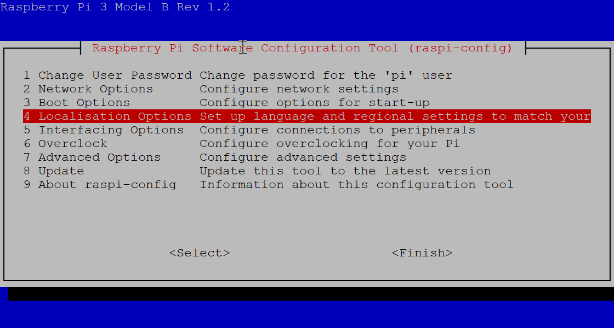
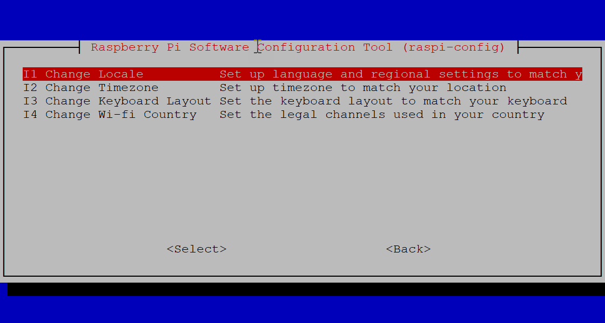
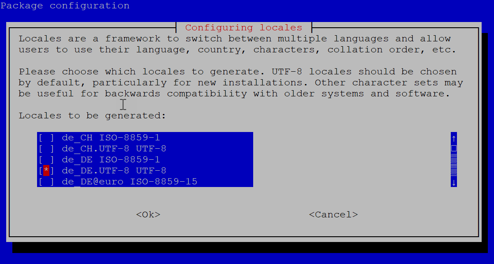
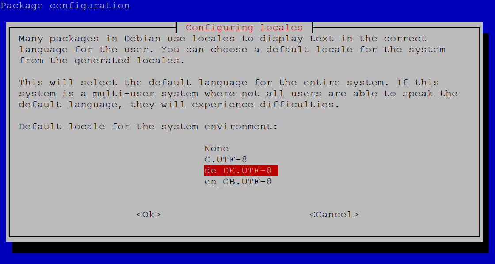
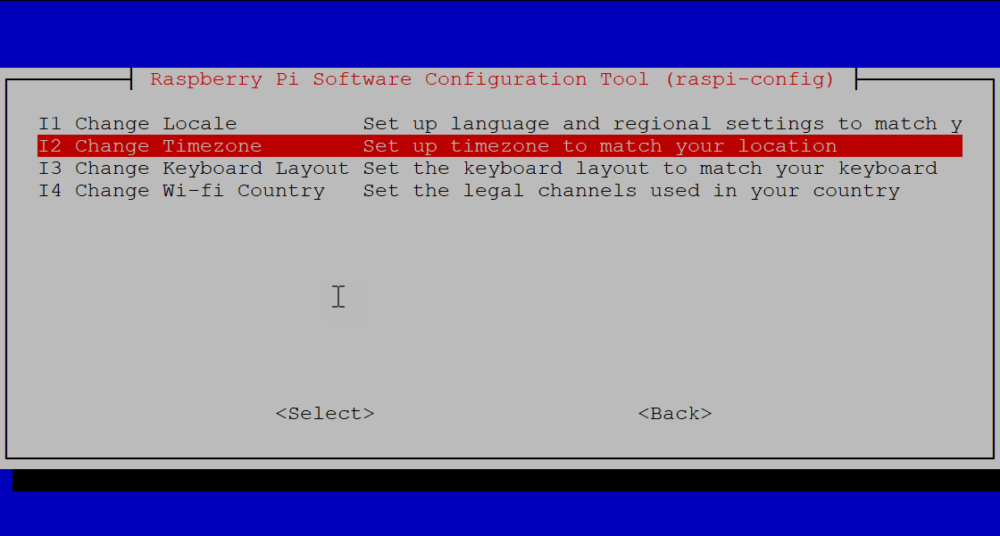
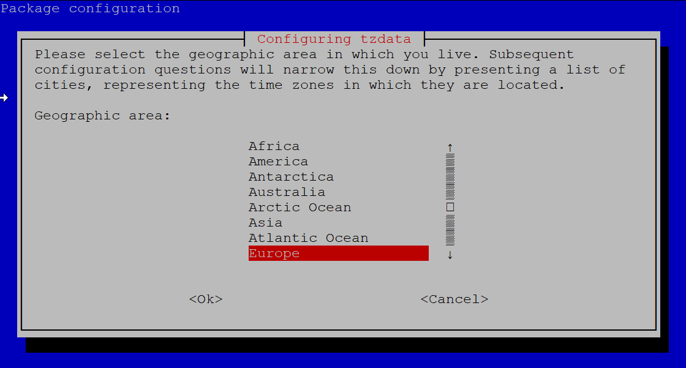
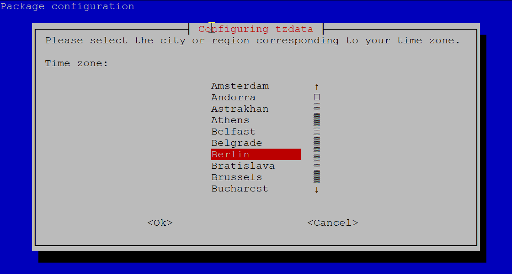

# Raspbian

Raspbian ist ein Betriebssystem das speziell für den Raspberry Pi angepasst wurde. Es basiert auf der Linux Distribution Debian.

## Inhaltsverzeichnis
[[toc]]

## Installation

- Lade dir den Raspberry Pi Imager herunter. [download](https://www.raspberrypi.org/downloads/)

- Lege die SD Karte in deinen Cardreader am Computer ein.

- Starte den Raspberry Pi Imager.

- Wähle bei "Operating System" mit einem Klick auf "Choose OS" den Menüpunkt "Raspbian (other)" aus und wähle im darauffolgenden Menü "Raspbian Lite".

- Danach wähle unter "SD Card" mit einem Klick auf "Choose SD Card" deine eingelegte SD Karte aus.

- Mit einem Klick auf "Write" startest du den Installationsvorgang.

- Warte auf den Abschluss des Kopiervorganges.

- Entferne die SD Karte und lege sie direkt wieder am Computer ein.

- Öffne das Laufwerk "bootpartition" und erstelle eine leere Datei mit dem Namen "ssh" OHNE Dateiendung. Dies aktiviert den SSH Service der nötig ist, um sich später mit Hilfe von Putty auf dem Server anzumelden.

## Ersteinrichtung

### Der erste Start

- Lege die frisch bespielte SD Karte in den Raspberry Pi ein.

- Verbinde den Raspberry Pi mit Hilfe des LAN-Kabel mit deinem Router.

- Stecke das Netzteil in deinen Pi um Ihn zu starten.

### Den Pi im Netzwerk finden

- Warte 1-2 Minuten bis der Raspberry Pi fertig gestartet ist.

- Schaue in deinem Router nach, welche IP Adresse dein Pi im Netzwerk bekommen hat.

### Mit dem Pi verbinden

- Lade dir Putty herunter. [download](https://www.chiark.greenend.org.uk/~sgtatham/putty/latest.html) 

- Starte Putty und gib die IP Adresse deines PIs ein und verbinde dich mit SSH zu deinem Raspberry.

- Der Benutzername lautet 'pi' und das Passwort lautet 'raspberry'

### Passwort ändern
Zuerst solltest du das Passwort ändern, denn alle Raspbian Installationen besitzen bei der Installation das gleiche Passwort. Dies stellt natürlich eine Sicherheitslücke da.

Gib dazu in Putty folgenden Befehl ein

```bash
passwd
```

Dann musst du zunächst das alte Passwort, in diesem Fall 'raspberry' eingeben. Im Anschluss kannst du dann ein neues Passwort festlegen.

:::tip
Während der Eingabe wird Ihnen das Passwort, wie bei Linux üblich, nicht angezeigt.
:::

### System aktualisieren

Zuerst aktualisiere die Paketquellen und Pakete. Gib dazu folgenden Befehl in Putty ein
```bash
sudo apt-get update && sudo apt-get upgrade
```

### System konfigurieren
Nun ist es an der Zeit, den Raspberry zu konfigurieren. Dazu gibt es ein kleines Programm, das uns die  Konfiguration etwas erleichtert.

Gib dazu in Putty folgenden Befehl ein um das Raspberry Pi Software Configuration Tool zu starten

```bash
sudo raspi-config
```
### Sprache einstellen

Dort stellen wir unser System erstmal auf deutsch um. Wähle dazu den Menüpunkt 'Localisation Options' aus.

:::tip
Mit der Tab Taste kann man zwischen dem Dialoginhalt und den Dialog Schaltflächen wechseln.
:::



Im darauf folgenden Dialog wählst du den Menüeintrag 'Change Locale' aus.



Im nächsten Dialog wählen wir dann die Sprache und das Encoding für unser System aus. In unserem Fall 'de_DE.UTF-8 UTF-8' und bestätigen das ganze mit 'Ok'.



Im nächsten Dialog setzen wir dann unsere gewählte Sprache als Standard. Dies dauert einen Moment.



### Zeitzone einstellen

Wieder zurück im Hauptmenü öffnen wir erneut die Einstellungen für die 'Localisation Options'


Im darauf folgenden Dialog wählen wir den Menüpunkt 'Change Timezone' aus.



Im nächsten Dialog wählen wir dann 'Europe' als Kontinent aus.



Zum Schluss wählen wir noch 'Berlin' als Stadt aus.



Das war es erstmal mit der Erstkonfiguration. Im nächsten Schritt widmen wir uns OpenMediaFault um aus unserem Raspberry Pi ein vollwertiges NAS (Network Attached Storage) zu machen.


